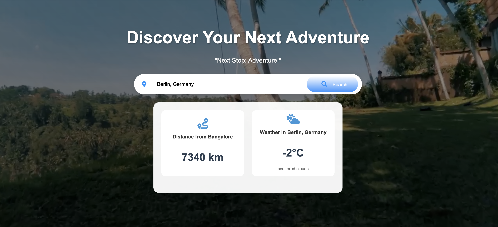
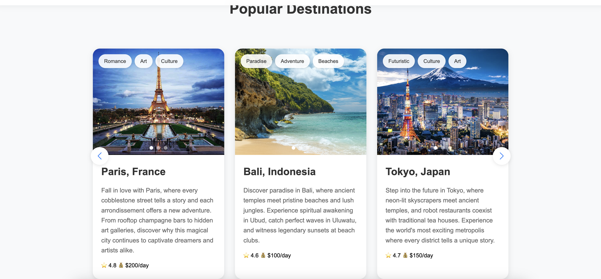
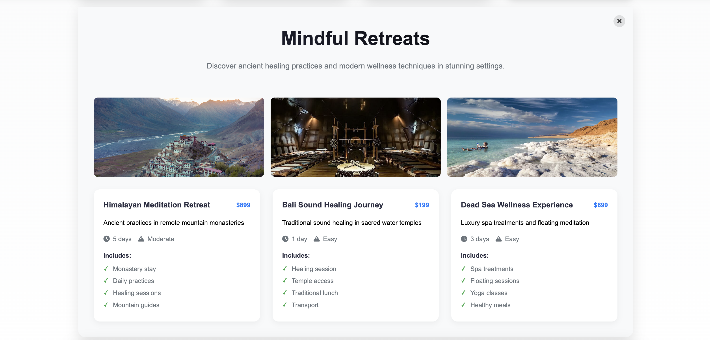
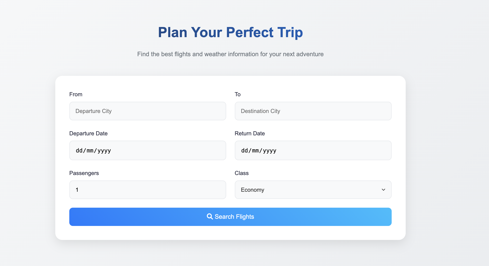
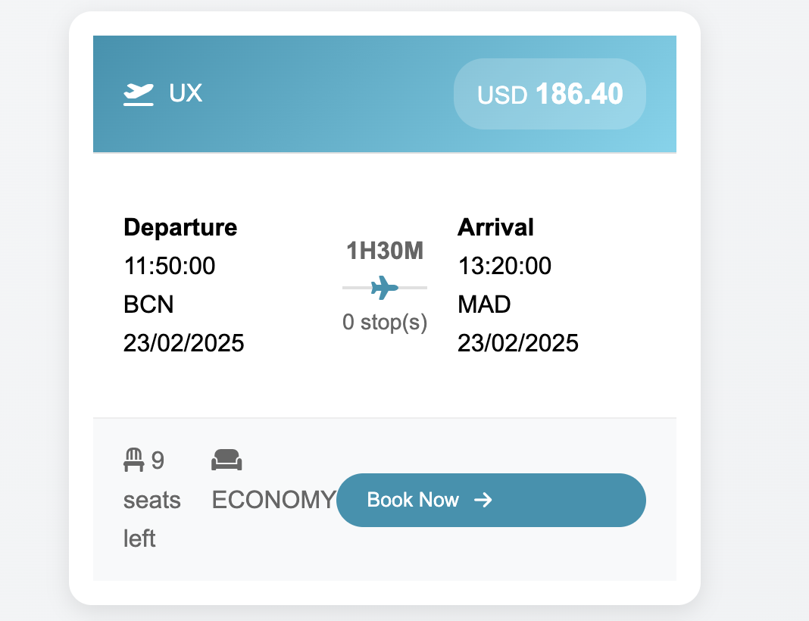

# Wanderlust - Your Travel Planner

## Overview
Wanderlust is a travel website designed to help users plan their trips efficiently. Built using HTML, CSS, JavaScript, and Node.js for the backend, this website integrates multiple APIs to provide real-time travel insights.

## Features

### 1. Weather and Distance Information
- Uses the OpenWeather API to fetch real-time weather details for the destination.
- Displays the distance from the default location (Bangalore) to the selected destination.

### 2. Popular Destinations Carousel
- A visually appealing carousel featuring trending travel destinations.

### 3. Unique Experiences
- Highlights unique travel experiences curated for different destinations.

### 4. Plan Your Trip (Flight Search)
- Allows users to search for flights between two locations.
- Uses the Amadeus Flight Offers API (currently being improved for reliability).
- Includes mock flights as a fallback when the API fails.
- Displays real-time flight search results.

## Technology Stack
- **Frontend:** HTML, CSS, JavaScript (DOM Manipulation)
- **Backend:** Node.js
- **APIs Used:**
  - OpenWeather API (Weather and Distance Calculation)
  - Amadeus Flight Offers API (Flight Search)

## Purpose
Wanderlust is designed as a **Travel Itinerary Builder with Real-Time Updates**, helping users create and manage travel plans efficiently. The website provides essential travel information, including flights, weather, and attractions, in a seamless user experience.

## Future Improvements
- Enhancing Amadeus API integration for better reliability.
- Adding more travel insights, such as local attractions and accommodation suggestions.
- Implementing user authentication for personalized travel itineraries.

## Installation and Usage
1. Clone the repository.
2. Install dependencies using `npm install`.
3. Start the server using `node server.js`.
4. Open the website in a browser and start planning your journey!

## Contributions
Contributions and suggestions are welcome! Feel free to fork the repository and submit pull requests.

## License
This project is open-source and available under the MIT License.

